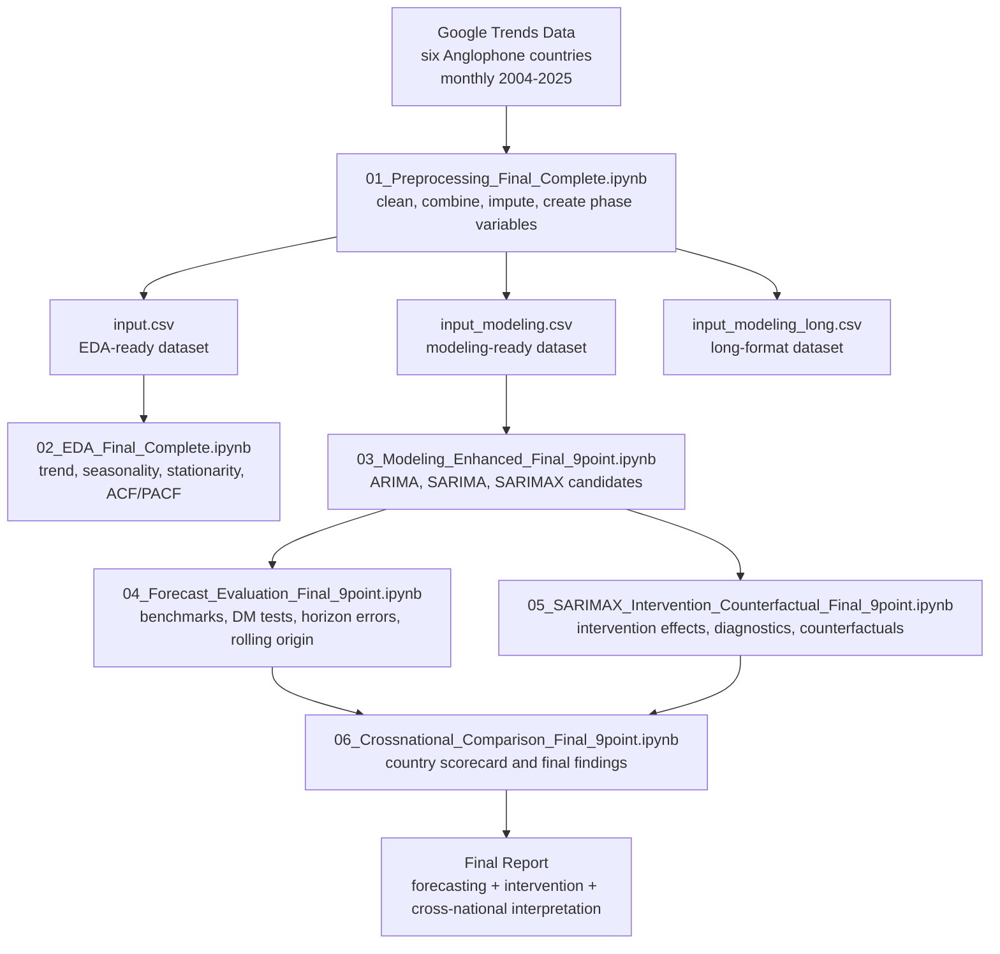

# Modeling COVID-Period Dynamics in Anxiety Search Behavior

> **Project:** ARIMA, SARIMA, and SARIMAX Intervention Analysis Across Six Anglophone Countries  
> **Dataset:** Monthly Google Trends topic-level search indices  
> **Period:** January 2004 – December 2025  
> **Final Report:** `HLinh_TS_Final_Report_9point.pdf`  
> **Hanoi, May 2026**

---

## 1. Project Overview

This project studies **COVID-period and post-COVID dynamics in anxiety-related Google search behavior** across six Anglophone countries:

```text
Australia, Canada, Ireland, New Zealand, United Kingdom, United States
```

The project applies **ARIMA, SARIMA, and SARIMAX intervention models** to monthly Google Trends data from **2004-01 to 2025-12**. The main dependent variable is the Google Trends topic-level index for **Anxiety**. Other mental-health search topics are retained in the cleaned dataset for transparency and possible robustness analysis.

The project is **not framed as a pure forecasting competition**. Simple benchmark models are included because they are necessary forecast reference models, but the central objective is broader:

| Research Question | Project Component |
|---|---|
| Is anxiety search behavior persistent over time? | ARIMA baseline |
| Does anxiety search behavior show annual seasonality? | SARIMA seasonal model |
| Did COVID and post-COVID periods create level or trend shifts? | SARIMAX intervention model |
| Do complex time-series models beat simple benchmarks in post-COVID forecasting? | Forecast evaluation and Diebold-Mariano tests |
| Are COVID-period patterns similar across countries? | Cross-national comparison |
| How do observed anxiety searches compare with a no-COVID projected baseline? | SARIMA counterfactual analysis |

The final workflow is:

```text
Google Trends Data
    → Data Preprocessing
    → Exploratory Time-Series Analysis
    → ARIMA / SARIMA / SARIMAX Modeling
    → Forecast Evaluation vs Benchmarks
    → SARIMAX Intervention Analysis
    → SARIMA Counterfactual Analysis
    → Cross-National Comparison
    → Research Report
```

---

## 2. Research Context

Mental-health-related search behavior became an important real-time signal during the COVID-19 period. Survey-based mental-health measures are often delayed, costly, or collected at low frequency. Google Trends provides monthly relative search-interest indices that can be used to study changes in public attention to mental-health topics.

This project focuses on **anxiety search behavior** because the exploratory analysis shows that it has the clearest long-run trend and the most direct link to the COVID mental-health narrative.

The project avoids two common overclaims:

```text
Wrong claim 1: Google Trends anxiety searches measure clinical anxiety prevalence.
Wrong claim 2: COVID uniformly increased anxiety searches across all countries.
```

The correct interpretation is more cautious:

```text
Google Trends measures relative search interest, not clinical prevalence.
COVID-period anxiety search behavior is persistent, seasonal, country-specific, and model-sensitive.
```

---

## 3. Key Results

### 3.1 Best Post-COVID Test Forecast Model by Country

| Country | Best model | RMSE | sMAPE |
|---|---:|---:|---:|
| Australia | Seasonal Naive | 5.221 | 4.512 |
| Canada | Seasonal Naive | 5.064 | 4.942 |
| Ireland | Seasonal Naive | 5.510 | 5.252 |
| New Zealand | Seasonal Naive | 8.227 | 7.402 |
| United Kingdom | Seasonal Naive | 4.711 | 4.422 |
| United States | Naive | 4.299 | 3.510 |

**Interpretation:** simple persistence and seasonal-persistence benchmarks dominate the full post-COVID test period. This does not invalidate ARIMA/SARIMA/SARIMAX. It shows that the post-COVID period is relatively stable and seasonally regular.

---

### 3.2 Average Test Performance by Model Class

| Model class | RMSE | sMAPE | Interpretation |
|---|---:|---:|---|
| Seasonal Naive | 5.989 | 5.543 | Best full-test forecast benchmark |
| Naive | 9.312 | 9.060 | Strong persistence benchmark |
| ARIMA | 10.688 | 10.093 | Non-seasonal time-series baseline |
| SARIMA | 11.395 | 10.823 | Captures seasonal structure, stronger at short horizons |
| SARIMAX | 23.169 | 22.751 | Weak long-horizon forecast model, but useful for intervention explanation |

---

### 3.3 Diebold-Mariano Test Summary

| Model class | Tests | Significant at 5% | Mean loss difference | Median p-value |
|---|---:|---:|---:|---:|
| ARIMA | 6 | 5 | 89.141 | 0.006 |
| SARIMA | 6 | 5 | 106.565 | 0.026 |
| SARIMAX | 6 | 5 | 601.331 | 0.000 |

Positive loss differences mean that ARIMA, SARIMA, and SARIMAX generally have higher squared forecast loss than the best benchmark in the full post-COVID test period.

---

### 3.4 Horizon-Specific Forecast Result

| Forecast horizon | Best average model | RMSE | sMAPE |
|---|---:|---:|---:|
| h01-03 | SARIMA | 3.776 | 3.733 |
| h04-12 | Seasonal Naive | 5.442 | 5.142 |
| h13-24 | Seasonal Naive | 4.831 | 4.510 |
| h25+ | Seasonal Naive | 8.426 | 8.329 |

**Key point:** SARIMA is useful for **short-horizon dynamics**, while the seasonal-naive benchmark dominates medium and long post-COVID horizons.

---

### 3.5 Significant SARIMAX Intervention Terms

| Country | Term | Coefficient | p-value | Direction |
|---|---|---:|---:|---|
| Australia | covid_trend | -0.519 | 0.030 | negative |
| Australia | post_covid_period | -23.760 | 0.025 | negative |
| Australia | post_covid_trend | -0.962 | 0.005 | negative |
| Canada | post_covid_trend | -0.647 | 0.002 | negative |
| United Kingdom | early_covid_shock | -9.869 | 0.000 | negative |
| United Kingdom | post_covid_trend | -0.526 | 0.035 | negative |
| United States | post_covid_trend | -0.497 | 0.049 | negative |

**Interpretation:** statistically significant SARIMAX intervention effects are country-specific and negative. The evidence does **not** support a uniform positive COVID-period increase in anxiety searches.

---

### 3.6 Logit Counterfactual Gap by Country, 2020-2025

| Country | Mean gap | Percent gap | Share above counterfactual | Share above upper 95% interval |
|---|---:|---:|---:|---:|
| Australia | -7.982 | -8.532 | 0.097 | 0.028 |
| Canada | -2.949 | -3.277 | 0.347 | 0.056 |
| Ireland | -14.474 | -15.314 | 0.014 | 0.000 |
| New Zealand | -8.031 | -8.459 | 0.181 | 0.042 |
| United Kingdom | -3.655 | -3.996 | 0.319 | 0.097 |
| United States | 0.714 | 0.824 | 0.556 | 0.153 |

A negative gap means observed anxiety searches were below the no-COVID SARIMA projection. Five of six countries show negative logit counterfactual gaps over the full 2020-2025 period.

---

## 4. Dataset

The project uses **monthly Google Trends topic-level relative search-interest indices**.

### 4.1 Coverage

| Item | Value |
|---|---:|
| Countries | Australia, Canada, Ireland, New Zealand, United Kingdom, United States |
| Frequency | Monthly |
| Start date | 2004-01 |
| End date | 2025-12 |
| Months per country | 264 |
| Rows in modeling dataset | 1,584 |
| Main variable | anxiety |
| Supplementary variables | depression, stress, insomnia, mental_disorder |

### 4.2 Core Data Files

The project can be run without keeping local `raw/` or `processed/` folders if the data are loaded from direct URLs.

| File | Format | Purpose |
|---|---|---|
| `input.csv` | wide country-panel | EDA-ready cleaned dataset |
| `input_modeling.csv` | wide country-panel | complete modeling-ready dataset |
| `input_modeling_long.csv` | long format | plotting, variable summaries, cross-country comparison |
| `01_modeling_data_dictionary.md` | markdown | variable definitions, imputation policy, phase design |

---

## 5. COVID Phase Definition

The final project uses a three-phase structure.

| Phase | Period | Months per country | Role |
|---|---:|---:|---|
| Pre-COVID | 2004-01 to 2019-12 | 192 | baseline period |
| COVID period | 2020-01 to 2023-05 | 41 | intervention period |
| Post-COVID | 2023-06 to 2025-12 | 31 | post-intervention adjustment period |

The modeling dataset includes five SARIMAX intervention variables.

| Variable | Definition | Role |
|---|---|---|
| `early_covid_shock` | 1 from 2020-03 to 2020-06; 0 otherwise | early pandemic shock |
| `covid_period` | 1 from 2020-01 to 2023-05; 0 otherwise | COVID-period level shift |
| `covid_trend` | monthly counter from 1 to 41 during COVID period; 0 otherwise | COVID-period slope change |
| `post_covid_period` | 1 from 2023-06 to 2025-12; 0 otherwise | post-COVID level shift |
| `post_covid_trend` | monthly counter from 1 to 31 during post-COVID period; 0 before 2023-06 | post-COVID slope change |

---

## 6. Project Pipeline



---

## 7. Methodology

---

### Step 1 — Data Preprocessing

**Notebook:** `01_Preprocessing_Final_Complete.ipynb`

This notebook cleans and combines the country-level Google Trends files.

Main tasks:

- Standardize monthly date format.
- Standardize country names.
- Rename topic-level mental-health variables into snake-case names.
- Treat selected Google Trends zeros as low-volume or insufficient-volume observations.
- Apply short-gap interpolation.
- Fill remaining edge missing values for modeling.
- Create variable-specific imputation flags.
- Create COVID phase variables.
- Export EDA-ready, modeling-ready, and long-format datasets.

Expected outputs:

```text
01_input.csv
01_input_modeling.csv
01_input_modeling_long.csv
modeling_data_dictionary.md
```

---

### Step 2 — Exploratory Data Analysis

**Notebook:** `02_EDA_Final_Complete.ipynb`

This notebook establishes the time-series properties that justify ARIMA, SARIMA, and SARIMAX modeling.

Main tasks:

- Plot country-level anxiety search series.
- Compare pre-COVID, COVID, and post-COVID phases.
- Compute descriptive statistics.
- Check stationarity using ADF and KPSS tests.
- Inspect ACF and PACF patterns.
- Identify annual seasonality at monthly lags 12, 24, and 36.
- Motivate candidate ARIMA/SARIMA orders.

Expected outputs:

```text
02_summary_statistics.csv
02_stationarity_tests.csv
02_phase_comparison.csv
02_acf_pacf_plots/
02_time_series_plots/
```

---

### Step 3 — ARIMA, SARIMA, and SARIMAX Modeling

**Notebook:** `03_Modeling_Enhanced_Final_9point.ipynb`

This notebook fits candidate ARIMA, SARIMA, and SARIMAX models and produces raw outputs used by the later evaluation and interpretation notebooks.

Model roles:

| Model | Role |
|---|---|
| ARIMA | non-seasonal time-series baseline |
| SARIMA | seasonal monthly time-series model |
| SARIMAX | seasonal intervention model with COVID/post-COVID exogenous variables |
| Naive | persistence benchmark |
| Seasonal Naive | annual seasonal-persistence benchmark |

Data split:

| Split | Period | Purpose |
|---|---|---|
| Train | 2004-01 to 2021-12 | estimate candidate model parameters |
| Validation | 2022-01 to 2023-05 | select model specification |
| Test | 2023-06 to 2025-12 | final out-of-sample post-COVID evaluation |
| Counterfactual fit | 2004-01 to 2019-12 | estimate no-COVID SARIMA baseline |
| Counterfactual forecast | 2020-01 to 2025-12 | compare observed values against projected baseline |

Expected raw outputs:

```text
final_anxiety_model_class_comparison_enhanced.csv
final_anxiety_best_test_model_by_country_enhanced.csv
anxiety_diebold_mariano_vs_best_benchmark.csv
anxiety_horizon_specific_test_errors.csv
anxiety_rolling_origin_evaluation.csv
final_anxiety_sarimax_intervention_table_enhanced.csv
anxiety_residual_diagnostics_enhanced.csv
anxiety_counterfactual_monthly_enhanced.csv
anxiety_counterfactual_covid_gap_summary_enhanced.csv
```

---

### Step 4 — Forecast Evaluation

**Notebook:** `04_Forecast_Evaluation_Final_9point.ipynb`

This notebook evaluates whether ARIMA, SARIMA, and SARIMAX forecast the post-COVID test period better than naive and seasonal-naive benchmarks.

Main tasks:

- Compare RMSE, MAE, and sMAPE across model classes.
- Identify the best post-COVID test model by country.
- Run Diebold-Mariano tests against the best benchmark.
- Evaluate performance by forecast horizon group.
- Run rolling-origin robustness evaluation.
- Create report-ready forecast summary tables.

Expected outputs:

```text
04_best_test_forecast_model_by_country.csv
04_average_test_performance_by_model_class.csv
04_diebold_mariano_interpreted.csv
04_diebold_mariano_summary.csv
04_horizon_specific_average_errors.csv
04_rolling_origin_average_performance.csv
04_forecast_evaluation_summary.csv
```

---

### Step 5 — SARIMAX Intervention and Counterfactual Analysis

**Notebook:** `05_SARIMAX_Intervention_Counterfactual_Final_9point.ipynb`

This notebook interprets COVID and post-COVID intervention effects using full-sample SARIMAX coefficients and no-COVID SARIMA counterfactuals.

Main tasks:

- Estimate and reshape SARIMAX intervention coefficients.
- Identify statistically significant intervention terms.
- Interpret early-COVID shock, COVID level/trend, and post-COVID level/trend effects.
- Run residual diagnostics using Ljung-Box, ARCH-LM, and Jarque-Bera tests.
- Compare observed values with raw, capped, and logit counterfactual SARIMA forecasts.
- Generate country-level intervention interpretations.

Expected outputs:

```text
05_sarimax_intervention_terms_long.csv
05_significant_sarimax_intervention_terms.csv
05_full_sample_sarimax_residual_diagnostics.csv
05_country_intervention_interpretation.csv
05_counterfactual_version_summary.csv
05_counterfactual_by_country_phase.csv
05_logit_counterfactual_by_country_phase.csv
05_sarimax_intervention_counterfactual_summary.csv
```

---

### Step 6 — Cross-National Comparison

**Notebook:** `06_Crossnational_Comparison_Final_9point.ipynb`

This notebook combines forecast, intervention, diagnostic, and counterfactual evidence into a final country-level scorecard.

Main tasks:

- Summarize the best forecast model by country.
- Compare SARIMAX intervention evidence across countries.
- Add residual diagnostic labels.
- Add counterfactual evidence labels.
- Build final country scorecards for the report.
- Produce final research findings.

Expected outputs:

```text
06_crossnational_country_scorecard.csv
06_crossnational_country_scorecard_labeled.csv
06_crossnational_summary_for_report.csv
06_final_findings_for_report.csv
```

---

## 8. Key Findings

1. **Benchmarks dominate the full post-COVID forecast horizon.**  
   Seasonal Naive is the best test model in Australia, Canada, Ireland, New Zealand, and the United Kingdom. Naive is the best model in the United States.

2. **SARIMA remains useful for short-horizon forecasting.**  
   SARIMA is the best average model for horizons 1-3 months, showing that seasonal ARIMA dynamics still matter for short-run anxiety search behavior.

3. **SARIMAX is not the best pure forecasting model.**  
   SARIMAX extrapolates intervention dynamics poorly into the stable post-COVID test period.

4. **SARIMAX is still central to the research question.**  
   SARIMAX allows direct estimation of COVID and post-COVID level/trend effects after controlling for autoregressive and seasonal dynamics.

5. **The evidence does not support a uniform positive COVID-period increase.**  
   Statistically significant SARIMAX intervention terms are country-specific and negative or declining.

6. **Counterfactual evidence is mostly below the no-COVID baseline.**  
   The preferred logit counterfactual shows negative average gaps in five of six countries over 2020-2025.

7. **The strongest conclusion is heterogeneity and post-COVID normalization.**  
   Anxiety search behavior is persistent, seasonal, and country-specific. COVID-period dynamics are better described as heterogeneous normalization or decline than as a uniform positive shock.

---

## 9. Final Interpretation Rule

The project should **not** claim:

```text
ARIMA/SARIMA/SARIMAX generally outperform benchmark models.
COVID uniformly increased anxiety searches across all countries.
Google Trends anxiety searches measure actual clinical anxiety prevalence.
```

The project should claim:

```text
Simple benchmarks forecast the full post-COVID test period better.
SARIMA is useful for short-horizon seasonal dynamics.
SARIMAX is useful for intervention analysis, not long-horizon forecast dominance.
COVID-period and post-COVID anxiety search dynamics are heterogeneous across countries.
```

---

## 10. Repository Structure

```text
.
├── README.md
├── requirements.txt
├── 01_Preprocessing_Final_Complete.ipynb
├── 02_EDA_Final_Complete.ipynb
├── 03_Modeling_Enhanced_Final_9point.ipynb
├── 04_Forecast_Evaluation_Final_9point.ipynb
├── 05_SARIMAX_Intervention_Counterfactual_Final_9point.ipynb
├── 06_Crossnational_Comparison_Final_9point.ipynb
├── data/
├── modeling_outputs/
│   ├── 04_best_test_forecast_model_by_country.csv
│   ├── 04_average_test_performance_by_model_class.csv
│   ├── 04_diebold_mariano_interpreted.csv
│   ├── 05_significant_sarimax_intervention_terms.csv
│   ├── 05_counterfactual_version_summary.csv
│   ├── 06_crossnational_country_scorecard.csv
│   └── 06_final_findings_for_report.csv
├── figures/
│   ├── forecast_horizon_rmse.png
│   ├── sarimax_post_covid_trend_coefficients.png
│   ├── logit_counterfactual_gap_by_country.png
│   └── sarimax_ljungbox_pvalues.png
└── report/
    ├── Report_mental_search_trend.pdf
```

---

## 11. Requirements

Install the required Python packages:

```bash
pip install -r requirements.txt
```

Suggested `requirements.txt`:

```text
pandas
numpy
matplotlib
scipy
statsmodels
scikit-learn
jupyter
nbconvert
openpyxl
```

Optional packages, depending on notebook implementation:

```text
seaborn
pmdarima
arch
```

---

## 12. How to Run

Run notebooks in order.

```bash
jupyter nbconvert --to notebook --execute 01_Preprocessing_Final_Complete.ipynb
jupyter nbconvert --to notebook --execute 02_EDA_Final_Complete.ipynb
jupyter nbconvert --to notebook --execute 03_Modeling_Enhanced_Final_9point.ipynb
jupyter nbconvert --to notebook --execute 04_Forecast_Evaluation_Final_9point.ipynb
jupyter nbconvert --to notebook --execute 05_SARIMAX_Intervention_Counterfactual_Final_9point.ipynb
jupyter nbconvert --to notebook --execute 06_Crossnational_Comparison_Final_9point.ipynb
```

If notebooks are stored inside a `notebooks/` folder, use:

```bash
jupyter nbconvert --to notebook --execute notebooks/01_Preprocessing_Final_Complete.ipynb
jupyter nbconvert --to notebook --execute notebooks/02_EDA_Final_Complete.ipynb
jupyter nbconvert --to notebook --execute notebooks/03_Modeling_Enhanced_Final_9point.ipynb
jupyter nbconvert --to notebook --execute notebooks/04_Forecast_Evaluation_Final_9point.ipynb
jupyter nbconvert --to notebook --execute notebooks/05_SARIMAX_Intervention_Counterfactual_Final_9point.ipynb
jupyter nbconvert --to notebook --execute notebooks/06_Crossnational_Comparison_Final_9point.ipynb
```

---

## 13. Output Map

| Stage | Main outputs | Used by |
|---|---|---|
| Preprocessing | `input.csv`, `input_modeling.csv`, `input_modeling_long.csv` | EDA, Modeling |
| EDA | summary, stationarity, ACF/PACF tables and figures | Methodology justification |
| Modeling | raw model comparison, forecasts, SARIMAX coefficients, counterfactual raw outputs | Forecast evaluation, intervention analysis |
| Forecast Evaluation | benchmark comparison, DM tests, horizon errors, rolling-origin results | Results section |
| SARIMAX Intervention | significant terms, residual diagnostics, counterfactual summaries | Intervention and counterfactual sections |
| Cross-National Comparison | country scorecard, final findings table | Discussion and conclusion |

---

## 14. Limitations

- Google Trends measures relative search interest, not clinical mental-health prevalence.
- The index is normalized within the selected country and period, so raw cross-country levels are not directly comparable.
- Long-horizon SARIMA counterfactuals can over-extrapolate pre-COVID trends.
- SARIMAX residual diagnostics remain imperfect in some countries, especially Canada and the United Kingdom.
- The main report focuses on anxiety; other mental-health topics require separate robustness analysis before broad mental-health conclusions can be made.

---

## References

- Box, G. E. P., and Jenkins, G. M. (1976). *Time Series Analysis: Forecasting and Control*. Holden-Day.
- Hyndman, R. J., and Athanasopoulos, G. (2021). *Forecasting: Principles and Practice*. OTexts.
- Diebold, F. X., and Mariano, R. S. (1995). Comparing predictive accuracy. *Journal of Business & Economic Statistics*.
- Google Trends. Google Trends topic-level relative search interest index.
- World Health Organization. (2023). Statement on the fifteenth meeting of the IHR Emergency Committee on the COVID-19 pandemic.
